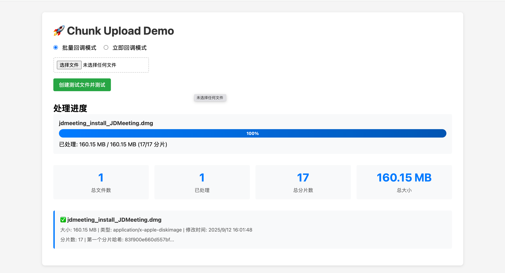

# Chunk Upload

> 一个简单快速的文件分片上传库，使用 Web Workers 进行并行处理



## ✨ 特性

- 🚀 **快速分片**：使用 Web Workers 并行处理，充分利用多核 CPU
- 📦 **多文件支持**：支持同时处理多个文件
- ⚙️ **自适应分片**：根据文件大小自动调整分片大小和 Worker 数量
- 🔄 **两种模式**：批量回调模式和流式回调模式
- 🧮 **SHA-256 哈希**：为每个分片计算 SHA-256 哈希值（使用 Web Crypto API）
- 📊 **进度跟踪**：实时进度回调
- ❌ **取消支持**：支持取消正在进行的操作
- 🔁 **重试机制**：支持失败自动重试
- ✅ **文件验证**：支持文件类型和大小验证
- 💾 **内存优化**：LRU 缓存策略，避免内存泄漏
- 🏗️ **Worker 池管理**：自定义 Worker 池，高效管理多线程任务

## 📦 安装

```bash
npm install @xumi/chunk-upload
# 或
pnpm add @xumi/chunk-upload
# 或
yarn add @xumi/chunk-upload
```

## 🚀 快速开始

### 基础用法

```typescript
import { chunkUpload } from "@xumi/chunk-upload";

// 方式1: 使用选择器（事件监听模式）
const controller = chunkUpload("#file-input", {
  onProgress: (progress) => {
    console.log(`进度: ${progress.percentage}%`);
  },
  lastCallback: (files) => {
    console.log("所有文件处理完成:", files);
  },
});

// 取消操作
controller.cancel();

// 方式2: 使用 File 对象（Promise 模式）
const result = await chunkUpload(file, {
  onProgress: (progress) => {
    console.log(`进度: ${progress.percentage}%`);
  },
});
console.log(result); // FileInfo[]
```

### 流式回调模式

```typescript
import { chunkUploadStream } from "@xumi/chunk-upload";

// 每个分片处理完成后立即回调
const controller = chunkUploadStream("#file-input", {
  callback: (chunk) => {
    console.log("分片完成:", chunk);
    console.log("是否完成:", chunk.isDone);
  },
  onProgress: (progress) => {
    console.log(`进度: ${progress.percentage}%`);
  },
});
```

## 📖 API 文档

### chunkUpload

批量回调模式：文件的所有分片处理完成后才回调。使用 Web Workers 并行处理，性能更高。

**函数签名：**

```typescript
// 选择器模式（返回 CancelController）
function chunkUpload(
  selector: string,
  options?: FragmentUploadOptions
): CancelController;

// File 对象模式（返回 Promise）
function chunkUpload(
  file: File,
  options?: FragmentUploadOptions
): Promise<FileInfo[]>;

// FileList/File[] 模式（返回 Promise）
function chunkUpload(
  files: FileList | File[],
  options?: FragmentUploadOptions
): Promise<FileInfo[]>;
```

**选项：**

- `perCallback?: (fileInfo: FileInfo & { isDone: boolean }) => void` - 每个文件处理完成时的回调函数
- `lastCallback?: (filesInfo: FileInfo[]) => void` - 所有文件处理完成时的回调函数
- `splitCallback?: (fileInfo: FileInfo) => void` - 文件分片完成时的回调函数
- `chunkSize?: number` - 分片大小（字节），默认2MB
- `workerCount?: number` - Web Worker数量，默认4
- `adaptiveChunkSize?: boolean` - 是否启用自适应分片大小
- `onError?: (error: UploadError) => void` - 错误处理回调函数
- `onProgress?: (progress: ProgressInfo) => void` - 上传进度回调函数
- `retry?: RetryConfig` - 重试配置
- `validation?: FileValidationConfig` - 文件验证配置

### chunkUploadStream

流式回调模式：每个分片处理完成后立即触发回调，适合需要实时处理分片的场景。

**函数签名：**

```typescript
// 选择器模式（返回 CancelController）
function chunkUploadStream(
  selector: string,
  options?: FragmentUpload1Options
): CancelController;

// File 对象模式（返回 Promise）
function chunkUploadStream(
  file: File,
  options?: FragmentUpload1Options
): Promise<void>;

// FileList/File[] 模式（返回 Promise）
function chunkUploadStream(
  files: FileList | File[],
  options?: FragmentUpload1Options
): Promise<void>;
```

**选项：**

- `callback?: (chunk: ChunkInfo & { isDone: boolean }) => void` - 每个分片处理完成时的回调函数
- `chunkSize?: number` - 分片大小（字节），默认2MB
- `workerCount?: number` - Web Worker数量，默认4
- `adaptiveChunkSize?: boolean` - 是否启用自适应分片大小
- `onError?: (error: UploadError) => void` - 错误处理回调函数
- `onProgress?: (progress: ProgressInfo) => void` - 上传进度回调函数
- `retry?: RetryConfig` - 重试配置
- `validation?: FileValidationConfig` - 文件验证配置

## 📝 完整示例

### 带进度条和错误处理

```typescript
import { chunkUpload } from "@xumi/chunk-upload";

const controller = chunkUpload("#file-input", {
  // 文件验证
  validation: {
    allowedTypes: ["image/*", "video/*"],
    maxSize: 100 * 1024 * 1024, // 100MB
  },

  // 进度回调
  onProgress: (progress) => {
    const progressBar = document.getElementById("progress-bar");
    if (progressBar) {
      progressBar.style.width = `${progress.percentage}%`;
    }
    console.log(`文件: ${progress.file.name}, 进度: ${progress.percentage}%`);
  },

  // 错误处理
  onError: (error) => {
    console.error("处理错误:", error.message);
    alert(`错误: ${error.message}`);
  },

  // 单个文件完成
  perCallback: (fileInfo) => {
    console.log(
      `文件 ${fileInfo.name} 处理完成，共 ${fileInfo.chunks.length} 个分片`
    );
  },

  // 所有文件完成
  lastCallback: (files) => {
    console.log(`所有文件处理完成，共 ${files.length} 个文件`);
  },

  // 重试配置
  retry: {
    maxRetries: 3,
    retryDelay: 1000,
    retryDelayMultiplier: 2,
  },
});

// 取消操作
document.getElementById("cancel-btn")?.addEventListener("click", () => {
  controller.cancel();
});
```

### 使用 Promise 模式

```typescript
import { chunkUpload } from "@xumi/chunk-upload";

async function handleFileUpload(file: File) {
  try {
    const result = await chunkUpload(file, {
      onProgress: (progress) => {
        console.log(`进度: ${progress.percentage}%`);
      },
      validation: {
        allowedTypes: ["image/*"],
        maxSize: 50 * 1024 * 1024,
      },
    });

    console.log("处理结果:", result);

    // 上传到服务器
    for (const fileInfo of result) {
      for (const chunk of fileInfo.chunks) {
        await uploadChunkToServer(fileInfo, chunk);
      }
    }
  } catch (error) {
    console.error("处理失败:", error);
  }
}
```

### 流式处理示例

```typescript
import { chunkUploadStream } from "@xumi/chunk-upload";

// 边处理边上传
const controller = chunkUploadStream(file, {
  callback: async (chunk) => {
    // 每个分片处理完成后立即上传
    await uploadChunkToServer(chunk);

    if (chunk.isDone) {
      console.log("所有分片处理完成");
    }
  },
  onProgress: (progress) => {
    console.log(`进度: ${progress.percentage}%`);
  },
});
```

## 🎯 类型定义

### ChunkInfo

```typescript
interface ChunkInfo {
  /** 分片起始位置（字节） */
  start: number;
  /** 分片结束位置（字节） */
  end: number;
  /** 分片索引（从0开始） */
  index: number;
  /** 分片的哈希值 */
  hash: string;
}
```

### FileInfo

```typescript
interface FileInfo {
  /** 文件名 */
  name: string;
  /** 文件MIME类型 */
  type: string;
  /** 文件大小（字节） */
  size: number;
  /** 文件最后修改时间戳 */
  lastModified: number;
  /** 文件分片信息数组 */
  chunks: ChunkInfo[];
}
```

### ProgressInfo

```typescript
interface ProgressInfo {
  /** 当前处理的文件 */
  file: File;
  /** 已上传的字节数 */
  loaded: number;
  /** 文件总字节数 */
  total: number;
  /** 上传进度百分比（0-100） */
  percentage: number;
  /** 当前处理的分片索引 */
  chunkIndex?: number;
  /** 总分片数 */
  totalChunks?: number;
  /** 已处理的分片数 */
  processedChunks?: number;
}
```

### UploadError

```typescript
interface UploadError {
  /** 错误类型 */
  type: ChunkUploadError;
  /** 错误消息 */
  message: string;
  /** 发生错误的文件 */
  file?: File;
  /** 发生错误的分片索引 */
  chunkIndex?: number;
  /** 原始错误对象 */
  originalError?: Error;
}
```

### RetryConfig

```typescript
interface RetryConfig {
  /** 最大重试次数，默认3次 */
  maxRetries?: number;
  /** 重试延迟时间（毫秒），默认1000ms */
  retryDelay?: number;
  /** 重试延迟倍数（每次重试延迟时间 = retryDelay * retryDelayMultiplier^重试次数），默认2 */
  retryDelayMultiplier?: number;
}
```

### FileValidationConfig

```typescript
interface FileValidationConfig {
  /** 允许的文件MIME类型列表 */
  allowedTypes?: string[];
  /** 禁止的文件MIME类型列表 */
  blockedTypes?: string[];
  /** 最大文件大小（字节） */
  maxSize?: number;
  /** 最小文件大小（字节） */
  minSize?: number;
  /** 自定义验证函数，返回true表示通过，返回字符串表示错误消息 */
  validate?: (file: File) => boolean | string;
}
```

### CancelController

```typescript
interface CancelController {
  /** 取消上传操作 */
  cancel: () => void;
  /** 检查是否已取消 */
  isCancelled: () => boolean;
}
```

## ⚙️ 配置选项

### 自适应分片大小

库会根据文件大小自动调整分片大小和 Worker 数量：

- **小文件（<10MB）**：1MB 分片，2 个 Worker
- **中等文件（10MB-100MB）**：5MB 分片，4 个 Worker
- **大文件（100MB-1GB）**：10MB 分片，6 个 Worker
- **超大文件（>=1GB）**：20MB 分片，最多 Worker

可以通过 `adaptiveChunkSize: false` 禁用自适应，手动指定 `chunkSize` 和 `workerCount`。

### 文件验证

```typescript
validation: {
  allowedTypes: ['image/*', 'video/*'],  // 允许的文件类型
  blockedTypes: ['application/x-msdownload'], // 禁止的文件类型
  maxSize: 100 * 1024 * 1024,          // 最大文件大小（100MB）
  minSize: 1024,                        // 最小文件大小（1KB）
  validate: (file) => {                // 自定义验证
    if (file.name.includes('virus')) {
      return '文件名包含敏感词汇'
    }
    return true
  },
}
```

### 重试配置

```typescript
retry: {
  maxRetries: 3,              // 最大重试次数
  retryDelay: 1000,          // 初始重试延迟（毫秒）
  retryDelayMultiplier: 2,   // 重试延迟倍数（指数退避）
}
```

## 🔄 两种处理模式对比

### chunkUpload（批量处理模式）

- ✅ 使用 Web Workers 并行处理，性能更高
- ✅ 适合大文件处理
- ✅ 返回所有分片信息，便于批量操作
- ❌ 需要等待所有分片处理完成

**适用场景：**

- 需要等待所有分片处理完成后再进行下一步操作
- 大文件处理，追求性能
- 批量处理场景

### chunkUploadStream（流式处理模式）

- ✅ 每个分片处理完立即回调，实时性好
- ✅ 内存占用更低
- ✅ 适合边处理边上传统场景
- ❌ 顺序处理，性能相对较低

**适用场景：**

- 需要实时处理每个分片（如边处理边上传）
- 流式处理场景
- 需要立即响应的场景

## 🧪 测试

```bash
# 运行测试
npm test

# 运行测试并查看覆盖率
npm run test:coverage

# 运行测试 UI
npm run test:ui
```

## 🛠️ 开发

```bash
# 开发模式（监听文件变化）
npm run dev

# 构建
npm run build

# 类型检查
npm run type-check

# 格式化代码
npm run format
```

## 📐 架构文档

详细的架构设计和工作流程说明，请查看 [ARCHITECTURE.md](./ARCHITECTURE.md)。

## 📄 License

MIT
